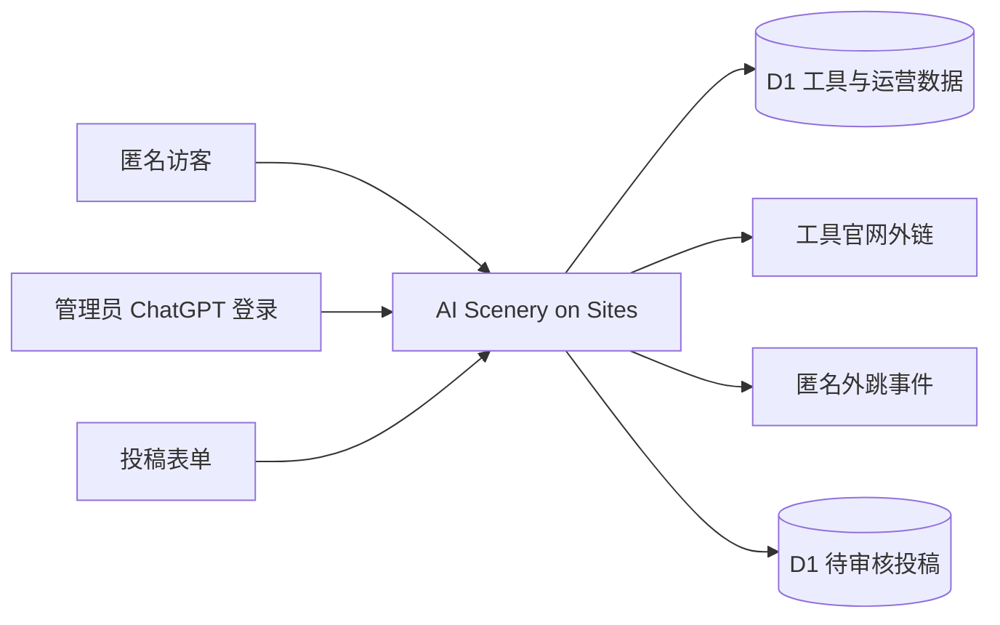

# AI Scenery MVP 详细与技术设计（Sites 版）

> 本文落实 `2026-08-31-ai-scenery-mvp-design.md`。AI Scenery 采用 Sites 托管，以任务导向的精选工具目录为核心；首版优先保证资料可信、检索迅速、单人运营可维护。

## 1. 架构决策

采用 Sites 的 Cloudflare Worker 运行时，不再使用 Go/Gin、Docker、VPS 或独立 PostgreSQL。前端和服务端均使用 TypeScript，构建为一个同源全栈应用：公开页面、管理员路由、API、D1 数据访问和外跳统计均在 Worker 中运行。

| 层次 | 选择 | 原因 |
| --- | --- | --- |
| Web 应用 | React + TypeScript + Vite，使用 Sites 初始化的 VINext 结构 | 在一个项目中交付可交互页面与 Worker 服务端路由。 |
| 托管与运行时 | Sites / Cloudflare Workers | 无需管理服务器；应用以版本形式部署，适合 MVP 快速迭代。 |
| 主数据 | Cloudflare D1（SQLite） | 工具、分类、场景、投稿与运营数据都是需持久化的结构化数据。 |
| 数据访问 | Drizzle ORM + D1 prepared statements | schema 与迁移可审查；运行查询使用参数绑定。 |
| 搜索 | D1 FTS5（trigram tokenizer） | 支持中文/英文工具名、别名、摘要和标签的全文检索；首版无需外部搜索服务。 |
| 管理认证 | ChatGPT 登录 + 服务端单用户 allowlist | 公开访客无需登录；`/admin` 仅允许指定的 ChatGPT 用户 ID，避免自行维护密码和账户。 |
| 图片 | 工具官方 Logo URL；R2 延后 | 首版不接收上传，降低版权、审核与存储复杂度。 |
| 测试 | Vitest + Worker 路由测试 + Playwright | 覆盖筛选、搜索、投稿、管理员发布和关键浏览路径。 |

不使用：Go/Gin、用户账户、第三方 CMS、向量数据库、消息队列、独立搜索服务、R2 和独立服务器。它们都不能直接提升首版“找到合适工具”的能力。

## 2. Sites 托管、开发与发布

Sites 负责将构建产物部署到 Cloudflare Worker，并创建/管理逻辑 D1 绑定。应用代码、D1 migrations 与站点托管元数据共同保存；密钥只配置为 Sites 运行时 secret，绝不进入代码仓库。

开发时使用 Vite 本地开发服务器和本地持久化 D1；所有 schema 修改都先生成 migration 并在本地验证。发布时先运行构建与测试，提交精确源码和迁移，再创建一个可回溯站点版本。首发先私有部署检查；转为公开访问前须由站点所有者明确批准。

日常运营包括：编辑在后台更新内容、发布后使受影响的公开读取缓存失效、定期导出 D1 数据作为独立备份、每月复核超过 90 天未核验的工具。发布版本和 D1 migration 是可追溯的，但 D1 导出备份仍应保留在独立位置。

## 3. 系统边界与请求流



公开页面与 API 只读取 `published` 工具；`/admin` 页面和所有写接口先要求 ChatGPT 登录，再验证请求头中的稳定用户 ID 等于 `ADMIN_USER_ID` secret。前端不得自行决定管理员权限。

## 4. 文件与模块边界

```text
app/
├── page.tsx                         # 首页
├── discover/, search/, scene/, tool/ # 公开页面路由
├── submit/                          # 投稿页
├── admin/                           # 受保护的编辑页面
├── api/                             # Worker 服务端 API 路由
├── components/                      # 卡片、搜索、筛选、表单等 UI
├── lib/
│   ├── db.ts                        # D1/Drizzle 连接入口
│   ├── catalog.ts                   # 工具目录读写查询
│   ├── search.ts                    # FTS5 查询与结果转换
│   ├── validation.ts                # Zod 输入 schema
│   └── admin-auth.ts                # ChatGPT 身份与 allowlist 校验
└── chatgpt-auth.ts                  # Sites starter 的登录 helper
drizzle/
├── schema.ts                        # Drizzle 表与类型定义
└── 0000_catalog.sql                 # Sites 构建会打包的、版本化 D1 SQL migration
tests/                               # 单元、路由和浏览器测试
.openai/hosting.json                 # project_id 与 D1 逻辑绑定
```

每个模块只处理一个职责：页面渲染不拼 SQL，API 只协调校验和领域查询，`lib` 层处理数据/身份细节。`app/chatgpt-auth.ts` 使用 Sites starter 提供的 helper，不自行实现 `/signin-with-chatgpt`、回调或登出路由。D1 migration 必须保存在仓库根目录 `drizzle/`，确保 Sites 构建产物携带 `dist/.openai/drizzle/`。

## 5. 路由与 API

| 页面/接口 | 访问者 | MVP 行为 |
| --- | --- | --- |
| `/` | 全部 | 搜索、热门场景、分类、精选工具和投稿入口。 |
| `/discover` | 全部 | 分类、地区、价格、平台筛选与分页工具卡。 |
| `/search?q=` | 全部 | FTS5 搜索，显示结果、相关场景和空状态。 |
| `/scene/:slug` | 全部 | 按实际任务组织的工具清单。 |
| `/tool/:slug` | 全部 | 工具说明、核验状态、官网外跳和替代工具。 |
| `/submit` | 全部 | 新工具推荐与资料纠错。 |
| `/go/:slug` | 全部 | 写入匿名外跳事件后 302 跳转官网。 |
| `/admin/login`、`/admin/*` | 管理员 | ChatGPT 登录并通过单人 allowlist 后，管理工具、场景、精选与投稿。 |
| `/api/*` | 页面/管理员 | 公开读取与管理员写入 API；写操作必须在服务端鉴权。 |

## 6. 数据模型与检索

- `categories`、`scenes`：名称、slug、描述、排序和启用状态。
- `tools`：名称、别名、简介、编辑推荐理由、官网、logo URL、定价、地区、语言、平台、发布状态、核验日期、首页排序与时间戳。
- `tool_categories`、`tool_scenes`、`tool_tags`：多对多关联。
- `tags`：能力、平台和体验标签。
- `submissions`：推荐/纠错内容、可选邮箱、审核状态、审核说明与时间。
- `outbound_events`：工具 ID、来源路径、发生时间；不保存 IP、账号或查询参数。
- `admin_audit_events`：动作、资源 ID、发生时间。

对 slug 和关系表建立唯一索引；对公开目录建立 `(status, featured_rank)` 和 `(status, verified_at)` 索引。`tool_search` 为 FTS5 虚表，聚合名称、别名、摘要和标签文本，使用 trigram tokenizer；工具发布或更新时在同一 D1 batch 中同步。查询须使用 prepared statement；以 `EXPLAIN QUERY PLAN` 验证常用筛选和搜索不发生不必要的全表扫描。

## 7. 认证、安全与运营规则

1. `/admin` 使用 `requireChatGPTUser()` 进行登录跳转；服务端随后检查稳定 user ID 是否等于 `ADMIN_USER_ID`。不以客户端状态、姓名或 email 单独授权。
2. 管理员新建工具草稿，填入官网、简介、分类/场景、定价和核验日期后才可发布。
3. 投稿进入待审核队列，管理员可批准、拒绝或转为工具草稿。
4. 投稿使用服务端 schema 校验、蜜罐字段和边缘防护；蜜罐 `company` 有值时返回成功但不写库。
5. 首页按 `featured_rank` 排序；没有精选排序的已发布工具仍在分类和搜索中显示。
6. 管理员每月处理核验日期超过 90 天的工具；官网失效时先归档，保留审核记录。

## 8. 输入、缓存与可访问性

- 工具写入要求：名称 1–80 字、slug、简介 20–160 字、合法 HTTPS 官网、至少一个分类或场景、定价和核验日期。
- 搜索词去空格后限制 2–80 字；每页 18 条，最大页数 100。
- 投稿必须有工具名、合法 HTTPS URL 和提交类型；邮箱可选，仅用于回复。
- 公开读取最多缓存 5 分钟；编辑发布、修改或归档后清理关联缓存。管理员和写接口不缓存。
- 核心页面在 360px 可读、可键盘操作、具备可见焦点和有意义的图片替代文本。

## 9. 启动前准备与范围

没有阻碍开发的外部前置项。开发可以立即开始；公开上线前准备两项即可：确定正式域名（可在开发后再绑定）以及完成至少 80 个工具、8 个分类、6 个场景的核验种子数据。

收录面向全球成熟、广泛应用且可验证可访问的产品，不按国内外比例配额。P1 再增加本地收藏、专题合集、失效链接检测、工具对比与复核提醒；P2 才讨论用户账户与个人推荐。
